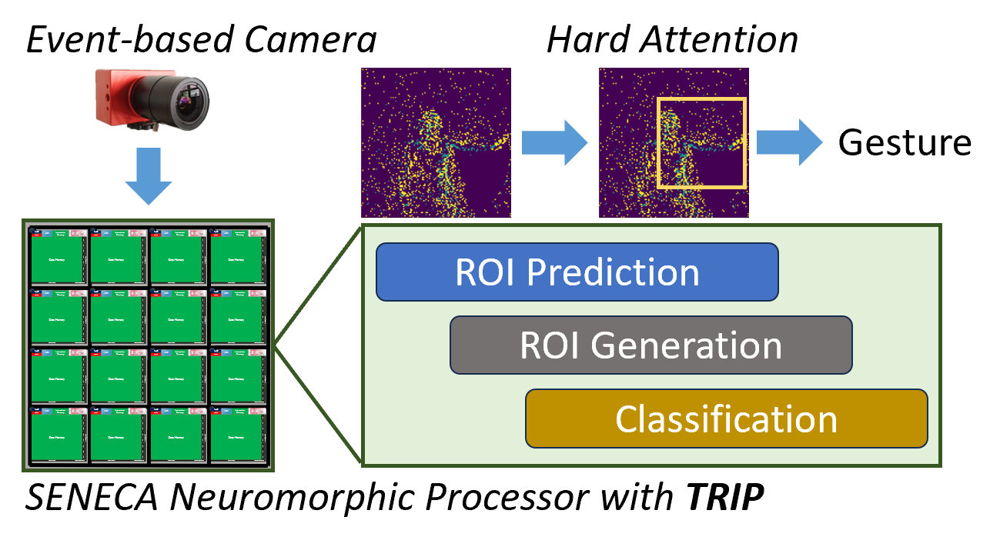

# TRIP - Trainable Region-of-Interest Prediction for Event-based Vision

This package is the PyTorch implementation of the **T**rainable **R**egion-of-**I**nterest **P**rediction (**TRIP**) algorithm. The algorithm trains a two-stage event-based neural network in an end-to-end fashion for hardware-efficient neuromorphic processing on event-based vision classification. The two-stage network consists of an ROI prediction network and a classification network.

The following figure shows an overview of the proposed method:



## Environment Setup ##

#### 1. Training Environment

* Ubuntu 20.04.6 LTS
* Python 3.8.10
* Nvidia RTX A6000 (Driver 535.161.07, CUDA 12.2)
* PyTorch 2.0
* SpikingJelly 0.14
* Tonic 1.3.3

The package is validated in our local GPU server using the training environment listed above. We have provided the `requirements.txt` for the python environment, we recommend setting up the environment using `venv`.

#### 2. Install Python vanv

We recommend to setup the training environment using python virtual environment. You can find more detailed resources [here](https://docs.python.org/3/library/venv.html).

To create the virtual environment:

```bash
python -m venv /path/to/new/virtual/environment
```

After creating the vistual environment, you can use the environment:

```bash
source /path/to/new/virtual/environment/bin/activate
```

Then install all the required packages from `requirements.txt`:

```bash
pip3 install -r /path/to/requirements.txt
```

You should have the complete environment training TRIP.

## Dataset ##

#### 1. DVSGesture dataset

The DVSGesture dataset need to be downloaded from the IBM server.

Download the dataset [here](https://ibm.ent.box.com/s/3hiq58ww1pbbjrinh367ykfdf60xsfm8/folder/50167556794) and copy all the downloaded items into `TRIP/datasets/dvsgesture/download/`.

During training, SpikingJelly will use the downloaded dataset for encoded dataset generation.

## DVSGesture Experiments ##

The code in `TRIP/dvsgesture/` reproduce the results for using TRIP on the DVSGesture dataset. The trained models are saved in `TRIP/dvsgesture/save_models/`. In this package, we provide the trained models with and without activation sparsity loss.

To test the trained model:

```bash
python run_trip_testing.py
```

You can change the model to test by changing `exp_name` and `experiment_number` variables in the python script.

You can also use `visualize_trip_testing.ipynb` to check out the ROI visualization in Jupter Notebook.

To train the model from scratch:

```bash
python run_trip_training.py
```

The training code will train 5 different trails with random initializations. Each model will be trained 1000 epochs and only the model with the best test accuracy is saved for each trail. You can change `spars_loss` between `True` and `False` to enable or disable activation sparsity loss.

To finetune the model using Dynamic Average Pooling (DAP) for hardware-efficient ROI generation implementation:

```bash
python run_dap_finetuning.py
```

You can change the model to finetune by changing `exp_name` and `experiment_number` variables in the python script. The DAP finetuning only train the classification network.
